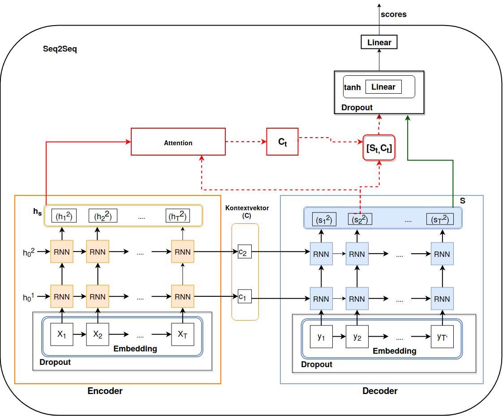

# Neural Machine Translation - Seq2Seq in PyTorch

This repository contains the code to my Bachelor Thesis about Neural Machine Translation.

## Setup the program

To setup the environment, create a virtual environment, e.g. `python3 -m venv env` and activate it by `source env/bin/activate`.
Then run the Bash script `bash setup.sh` to install all required dependencies.

## Training the model

### Download the corpus

To train the model on the Europarl-Dataset, you need to first preprocess the dataset. This is possible by running the script `preprocess.py`.
If you run the script without any arguments, the programm will download the corpus for the German language and preprocess it, by tokenizing it into words and creating the splits. All preprocessed files are stored in `data/preprocessed/europarl/de/splits/30/`

### Train the model

Now you can train the model with the script `train_model.py`. 
To display a list of all accepted arguments: `python train_model.py --help`.

The following is a sample image of the model architecture. This an encoder-decoder architecture, which can be configured in different ways. The image shows a 2-layer architecture. The best model was trained with 4 layers.
The number of layers is considered on Decoder side. The number of layers on Encoder side depends on its direction. If it is unidirectional, then the number of layers for the Encoder is the same as for the Decoder.
If you train the model with a bidirectional Encoder, then the Encoder will output 4 final results which are stored in the fixed-length context vector C. The Decoder will then have 4 layers, each of them starting with one of the Encoder results.




Sample command to train the model with GRUs:

GRU:
```python3 train_model.py --hs 300 --emb 300 --num_layers 2 --dp 0.25 --reverse_input False --bi True --reverse True --epochs 80 --v 30000 --b 64 --train 170000 --val 1020 --test 1190  --lr 0.0002 --tok tok --tied True --rnn gru --beam 5 --attn dot```

Sample command to train the model with LSTMs:

LSTM:
```python3 train_model.py --hs 300 --emb 300 --num_layers 2 --dp 0.25 --reverse_input False --bi True --reverse True --epochs 80 --v 30000 --b 64 --train 170000 --val 1020 --test 1190  --lr 0.0002 --tok tok --tied True --rnn lstm --beam 5--attn dot```


### Translate with a pretrained model

A translation can be performed with a pretrained model. 

To translate from a trained model, use the script `translate.py`. The script accepts following arguments:
1. `--path`: The path to the trained model is *mandatory*, e.g. `python train_model.py --path results/de_en/custom/lstm/2/bi/2019-08-11-10-30-31`. This will start the live translation mode.
2. `--file`: Add this argument, if you want to translate from a file. Argument should be a valid path.
3. `--beam`: Add this argument to setup a beam size which is different from 5 (default value)

The beam size can be changed during the live translation mode by typing `#<new_beam_size>`, e.g. `#10`.

### Training with IWSLT-Dataset by TorchText

If you do not want to use the Europarl dataset, just run the script `train_model.py` by passing an empty string for the argument `--corpus`. This will train the model on the IWSLT-Dataset (Ted Talks) of TorchText.


Enjoy!